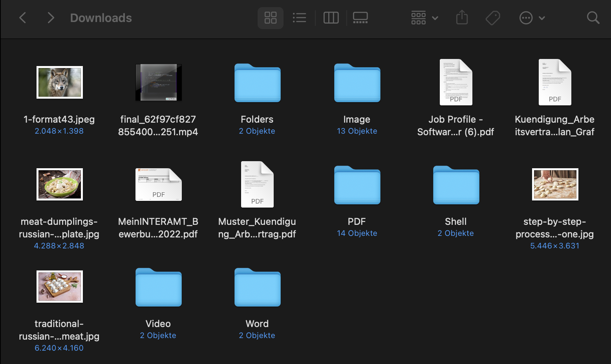

# File Manager
File manager that automatically sorts all files from the specified folders in the list under the download folder into the correct sub-folders. Sub-folders that don't exist will be created automatically. Accepted file formats so far are: .pdf, .jpg, .jpeg, .png, .mp4, .sh, .heic.

<p align="center">
  <br>
  
</p>

## Installation
```bash
pip install -r requirements.txt
```

## How To Use

1. Open dirs.py
2. Write into the DIRS_TO_CLEAN list the dirs you want to clean, e.g. Desktop, Downloads etc. Only the folder names that are directly in the home folder, otherwise specify a more precise path from the home folder.
3. That's it. Run the script!
